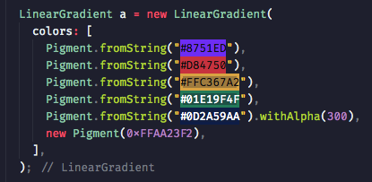

<p align="center">
     
</p>

# Pigment

[](https://pub.dartlang.org/packages/camera)

A simple but useful plugin for use colors with Flutter

## Features

*   You can use string colors (like #01E19F) direct in flutter
*   Pigment extends to Color dar:ui class, then you can use all methods of Color class

## Installation

First, add `pigment` as a [dependency in your pubspec.yaml file](https://flutter.io/using-packages/).

## Use

It's very simple, pigment add a new useful method to Color class, this method is `Pigment.fromString()`.
Also like Color, you can use `new Pigment()`.

<p align="center">
     
</p>

```dart
Pigment.fromString()
new Pigment()
```

## Example

Here is a small example flutter app displaying a full screen camera preview.

```dart
import 'package:flutter/material.dart';
import 'package:pigment/pigment.dart';

void main() => runApp(new MyApp());

class MyApp extends StatelessWidget {
  @override
  Widget build(BuildContext context) {
    return new MaterialApp(
      title: 'Pigment Demo',
      theme: new ThemeData(
        primarySwatch: Colors.red,
      ),
      home: new MyHomePage(),
    );
  }
}

class MyHomePage extends StatefulWidget {
  @override
  _MyHomePageState createState() => new _MyHomePageState();
}

class _MyHomePageState extends State<MyHomePage> {
  @override
  Widget build(BuildContext context) {
    return new Scaffold(
        appBar: new AppBar(
          title: new Text('Pigment App'),
        ),
        body: new Center(
          child: new Column(
            mainAxisAlignment: MainAxisAlignment.center,
            children: <Widget>[
              new Text('Pigment is cool',
                  style: new TextStyle(color: Pigment.fromString("#FE5567"))),
              new Text('Pigment is cool',
                  style: new TextStyle(color: Pigment.fromString("#01E19F"))),
              new Text('Pigment is cool',
                  style: new TextStyle(color: Pigment.fromString("#4A48D2"))),
              new Text('Pigment is cool',
                  style: new TextStyle(color: Pigment.fromString("#FFC367"))),
            ],
          ),
        ));
  }
}
```
